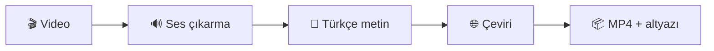

<div align="center">

# SubFrame

**Yapay zekâ destekli, tamamen sizin bilgisayarınızda çalışan video altyazı aracı**

[](https://nextjs.org/)
[](https://react.dev/)
[](https://www.typescriptlang.org/)
[](https://tailwindcss.com/)
[](https://nodejs.org/)

<br />


</div>

---

## Bu proje ne işe yarar?

**SubFrame**, yüklediğiniz videodaki **Türkçe konuşmayı metne çevirir**, istediğiniz dile **çevirir** ve altyazıyı videonun içine gömülü (**soft sub**) şekilde yeni bir **MP4** dosyası olarak hazırlar. Tarayıcıdan dosyayı seçip birkaç ayarı işaretlemeniz yeterli; işlem **kendi bilgisayarınızda çalışan** uygulama üzerinden ilerler.

| Adım | Ne oluyor? |
|:----:|------------|
| 1 | Videodan ses çıkarılır (**FFmpeg**) |
| 2 | Konuşma Türkçe metne dökülür (**OpenAI Whisper API** veya **yerel Whisper**) |
| 3 | Metin seçtiğiniz dile çevrilir (**Google**, isteğe bağlı **LibreTranslate** veya **Ollama**) |
| 4 | Altyazı videoya eklenir ve indirilebilir dosya üretilir |

> **Kısaca:** Konuşmalı Türkçe videonuzu alır → altyazılı, çeviri dilinize uygun bir video verir.



---

## Kimler için uygun?

- Altyazı eklemek isteyen **içerik üreticileri** ve **öğrenciler**
- Komut satırıyla uğraşmak istemeyen, **sade arayüz** tercih edenler
- Videolarının **bulut dışında**, **kendi makinesinde** işlenmesini isteyenler

Arayüz **açık / koyu tema** destekler; ilerleme ve günlük çıktısı ile işin hangi aşamada olduğunu görebilirsiniz.

---

## Hangi teknolojiler kullanılıyor?

Uygulama tarafında modern bir web yığını; medya ve yapay zekâ tarafında ise sistemde kurulu araçlar veya API’ler kullanılır.

| Alan | Teknoloji |
|------|-----------|
| Çerçeve | **Next.js 16** (App Router) |
| Arayüz | **React 19**, **TypeScript**, **Tailwind CSS 4** |
| Bileşenler | **shadcn** ekosistemi, **@base-ui/react** |
| İkonlar | **Lucide React** |
| Tema | **next-themes** |
| Konuşma → metin | **OpenAI** Transcription API (`whisper-1`) **veya** yerel **[Whisper](https://github.com/openai/whisper)** CLI |
| Çeviri | **google-translate-api-x**, isteğe bağlı **LibreTranslate**, isteğe bağlı **Ollama** (lokal LLM) |
| Medya | **FFmpeg** (sistemde kurulu `ffmpeg`) |

---

## Hangi modeller ve seçenekler var?

### Konuşma tanıma (Whisper)

- **Bulut:** `OPENAI_API_KEY` tanımlıysa **OpenAI** üzerinden **`whisper-1`** kullanılabilir (internet + API anahtarı gerekir).
- **Yerel:** Anahtar yoksa veya tercih ederseniz **Python ile kurulu `whisper` CLI** kullanılır. Arayüzden veya `.env` üzerinden örneğin **tiny**, **small**, **medium**, **large-v3** gibi modeller seçilebilir; **large-v3** genelde en iyi Türkçe sonuç için önerilir, daha zayıf donanımda **small** / **medium** daha mantıklı olabilir.

### Çeviri motoru

| Seçenek | Açıklama |
|---------|----------|
| **Google** (`google-translate-api-x`) | Varsayılan; ek sunucu kurmadan çalışır. Yoğun kullanımda limit riski olabilir. |
| **LibreTranslate** | Kendi veya herkese açık bir LibreTranslate sunucusu; `.env` içinde `LIBRETRANSLATE_URL` gerekir. |
| **Ollama** (ör. **qwen2.5:3b**, **7b**, **14b**) | Tamamen **yerel**; **[Ollama](https://ollama.com/)** kurulu ve ilgili model `ollama pull` ile indirilmiş olmalı. Varsayılan API adresi `http://127.0.0.1:11434` — `OLLAMA_URL` ile değiştirilebilir. |

### Hedef dil

Şu an arayüzde seçilebilen hedef diller: **Türkçe**, **İngilizce**, **Rusça**. Türkçe seçildiğinde çeviri adımı atlanır (altyazı zaten Türkçe üretilir).

---

## Ne kurmalıyım? (özet kontrol listesi)

Aşağıdakilerden **mutlaka** gerekenler: **Node.js**, **FFmpeg**, proje bağımlılıkları (`npm install`) ve **`.env`** dosyası.

| Bileşen | Ne zaman gerekli? |
|---------|-------------------|
| **Node.js** (20.x önerilir) | Her zaman — uygulama bununla çalışır |
| **FFmpeg** | Her zaman — ses/altyazı/video işlemi için |
| **OPENAI_API_KEY** | OpenAI ile konuşma tanıma istiyorsanız |
| **Yerel Whisper** (`pip install openai-whisper` vb.) | API anahtarı kullanmayacaksanız |
| **LibreTranslate sunucusu** | Çeviri motoru olarak Libre seçecekseniz |
| **Ollama** | Çeviri için Ollama modellerini seçecekseniz |

---

## Kurulum — adım adım

### 1) Node.js

[https://nodejs.org](https://nodejs.org) adresinden **LTS** sürümünü indirip kurun. Kurulumdan sonra terminalde kontrol edin:

```bash
node -v
npm -v
```

### 2) Projeyi indirip bağımlılıkları yükleyin

```bash
git clone <repo-adresi> sub-frame
cd sub-frame
npm install
```

### 3) FFmpeg

- **Windows:** [ffmpeg.org](https://ffmpeg.org/download.html) üzerinden indirip `PATH`’e ekleyin veya tam yolu `.env` içinde `FFMPEG_PATH` olarak verin.
- **macOS (Homebrew):** `brew install ffmpeg`
- **Linux:** dağıtımınızın paket yöneticisi ile `ffmpeg` kurun.

Doğrulama:

```bash
ffmpeg -version
```

### 4) Ortam dosyası (`.env`)

Örnek dosyayı kopyalayın:

```bash
# Windows PowerShell
Copy-Item .env.example .env
```

```bash
# macOS / Linux
cp .env.example .env
```

`.env` içinde en azından **Whisper** ve **FFmpeg** yolunuzu ihtiyaca göre düzenleyin. Özet:

- **OpenAI ile transkripsiyon:** `OPENAI_API_KEY=sk-...`
- **Sadece yerel Whisper:** `OPENAI_API_KEY` boş; `WHISPER_MODEL=large-v3` (veya donanımınıza uygun model). Gerekirse `WHISPER_CMD` / `WHISPER_PYTHON` ile tam yol verin.
- **Next.js `ffmpeg` veya `whisper` görmüyorsa:** `FFMPEG_PATH`, `WHISPER_CMD` gibi tam yolları kullanın (`.env.example` içinde açıklamalar var).

### 5) (İsteğe bağlı) Yerel Whisper

Python sanal ortamında örnek:

```bash
pip install openai-whisper
```

Ardından terminalde `whisper --help` veya `whisper -h` çalışıyor olmalı.

GPU kontrolü için projede:

```bash
npm run whisper:check-gpu
```

### 6) (İsteğe bağlı) Ollama ile çeviri

1. [Ollama](https://ollama.com/) kurun ve servisin çalıştığından emin olun.
2. Kullanacağınız modeli indirin, örneğin: `ollama pull qwen2.5:3b`
3. Uygulama arayüzünde çeviri motoru olarak ilgili **Ollama · qwen2.5:…** seçeneğini seçin.
4. Gerekirse `.env` içinde `OLLAMA_URL` ile adresi özelleştirin (varsayılan: `http://127.0.0.1:11434`).

### 7) Geliştirme sunucusunu başlatın

```bash
npm run dev
```

Tarayıcıda **[http://localhost:3000](http://localhost:3000)** adresini açın.

---

## Diğer komutlar

| Komut | Açıklama |
|--------|----------|
| `npm run dev` | Geliştirme sunucusu |
| `npm run build` | Üretim derlemesi |
| `npm run start` | Derlenmiş uygulamayı çalıştırma (`build` sonrası) |
| `npm run lint` | ESLint |
| `npm run whisper:check-gpu` | Yerel Whisper / PyTorch GPU bilgisi |

---

## Üretim derlemesi (yerel)

```bash
npm run build
npm run start
```

Varsayılan port **3000**; `PORT` ortam değişkeni ile değiştirilebilir.

---

## Önemli notlar

- İş durumu şu an **bellek içinde** tutulur; üretim ortamında tek süreç / kalıcı kuyruk düşünülmelidir.
- **Serverless** platformlarda (ör. klasik Vercel serverless) uzun video işleri, büyük yükleme ve arka plan işleri nedeniyle **doğrudan deploy genelde uygun değildir**. Sürekli çalışan bir sunucu (VPS, kendi makineniz vb.) veya kuyruk + worker mimarisi daha uygundur.
- Yükleme boyutu ve iş dosyası saklama süresi için `.env` içindeki `MAX_UPLOAD_BYTES` ve `JOB_TTL_MS` değerlerine bakın.

---

## Proje yapısı (kısa)

```
app/           # Sayfalar ve API (process, status, download)
components/    # Arayüz bileşenleri
lib/           # Diller, iş durumu, pipeline yardımcıları
workers/       # FFmpeg, Whisper, çeviri
```

---

## Lisans ve yazar

`package.json` içinde proje **`private: true`** olarak işaretlenmiştir; dağıtım ve lisans koşulları proje sahibine aittir.

<div align="center">

<br />

**SubFrame**

*Yerelde çalışan, yapay zekâ destekli altyazı aracı*

**Göktürk Doğan** tarafından hazırlanmıştır.

<sub>Teknik olmayan kullanıcılar için: yukarıdaki adımları sırayla uygulayıp takıldığınız yerde `.env.example` dosyasındaki açıklamalara bakabilirsiniz.</sub>

</div>
